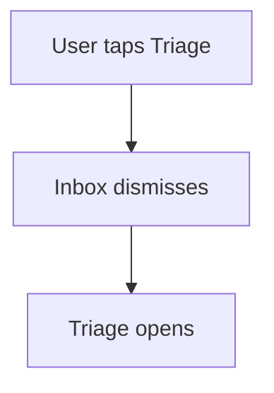
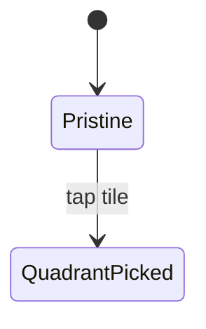

<!-- Canonical source: zheref/bankai-handbooks. Consumer repos carry a generated, pinned, per-surface mirror of this file (CON-13) -- never hand-edit the mirror; change it here. -->

# 13 — Feature Documentation

Implements **UZF-21** (language-agnostic feature spec) for the Jetpack Compose UZF
stack — the operational "where and how" for this repo family. Every feature in the
product gets a living, **language-agnostic** spec at `{{DOCS_ROOT}}/<FeatureName>.md`.
The intent is that a designer, PM, or engineer from any platform (iOS, macOS,
Android, web) can read those docs and understand *what* the feature does and *how*
its parts relate — without ever opening Kotlin code.

## Repo-specific placeholders

| Token | Illustrative example |
| --- | --- |
| `{{DOCS_ROOT}}` | `docs/Features` |
| `{{FLAG_ENUM}}` | `FeatureFlagsService` (the feature-flag registry) |
| `{{CORE_FRAMEWORK}}` | `AcmeCore` |
| `{{TEST_TARGET}}` | `app/src/test/java` (JVM unit tests) |
| `{{ANDROID_TEST_ROOT}}` | `app/src/androidTest/java` (instrumented tests) |
| `{{UI_MODULE}}` | the design-system / UI module |
| `{{THEME_ROOT}}` | `ui/theme` |

## Where docs live

```
docs/
  Features/
    <FeatureName>.md            # The feature specification — the only Markdown
                                # artifact per feature. Diagrams live INSIDE
                                # this file as fenced ```mermaid blocks
                                # (one or more).
    README.md                   # Optional: index of all features and flags.
    assets/                     # Optional shared screenshots / GIFs / PDFs.
                                # Per-feature assets can use a
                                # docs/Features/assets/<FeatureName>/ prefix.
```

- **One Markdown file per feature, flat under `{{DOCS_ROOT}}`.** No per-feature
  subfolder. Listing the Features directory in any editor produces a one-page menu
  of every spec.
- `{{DOCS_ROOT}}/README.md` (optional) indexes all features and their flag.
- File name is PascalCase and matches the conceptual feature name — **not** the
  implementation file name. Example: `docs/Features/Inbox.md`, not
  `docs/Features/InboxScreen.md`.
- Pre-existing topical docs at the root of `docs/` (e.g. legacy kebab-case files
  such as `feature-card.md` or `day-feature.md`) should migrate into this layout
  the next time their feature is touched.
- **No standalone `.mermaid` files.** They render only in editors that ship a
  dedicated mermaid extension (Zed, Warp, Android Studio without plugins, and
  default Markdown previewers do not). A ` ```mermaid ` fenced block inside a
  Markdown file is rendered out-of-the-box by GitHub, VS Code, Cursor, Zed, Warp's
  Markdown preview, Obsidian, and Typora — the common denominator.

## When a doc must exist (UZF-21)

A feature **must** have a doc file (`{{DOCS_ROOT}}/<FeatureName>.md`) if any of these
is true:

1. It is gated by an entry in the feature-flag registry (`{{FLAG_ENUM}}`, in
   `{{CORE_FRAMEWORK}}`).
2. It owns a top-level entry point in the UI (a tab, a sidebar item, a sheet
   reachable from another feature).
3. It is referenced by another feature's doc (i.e. it has a public-facing contract).

If a flag exists, the doc file name should match the flag's conceptual name (e.g.
flag `now` → `docs/Features/Now.md`; flag `googleCalendar` →
`docs/Features/GoogleCalendar.md`). **One feature flag = one doc file** (UZF-21),
even if the feature spans multiple screens.

## What goes in `{{DOCS_ROOT}}/<FeatureName>.md`

Markdown only. **No code blocks of implementation language.** Pseudocode or
interface sketches in a fenced ` ```text ` block are fine; concrete Kotlin/Swift
code is not. The doc must remain readable for the iOS team (or a PM, or a designer)
without translation.

The spec follows this skeleton (sections may be omitted when truly N/A — note the
omission):

```markdown
# <Feature Name>

## Purpose
One-paragraph statement of what the feature does for the user and *why* it exists.

## Feature flag
- Name: `<flagName>`
- Default state: enabled | disabled
- Rollout / sunset notes (if any)

## Entry points
Where the user starts using this feature (tab name, sheet, deep link, notification, etc.).

## Core concepts
Domain vocabulary used by the feature. Each term gets one line. Do NOT reference type
names from the codebase — name the concept the user / PM would name.

## User flows
Numbered list of the canonical flows. For each: trigger → steps → outcome.
Include the unhappy paths (offline, empty, permission denied).

## States
The high-level states the feature can be in (e.g. *idle*, *loading*, *triage-empty*,
*triage-with-cards*). Describe what the user sees in each.

## Interactions with other features
For each related feature, state the direction and shape of the interaction (delegated
event, shared model, navigation).

## Out of scope
What this feature does NOT do. Crucial when other docs link in.

## Open questions
Bulleted list. Each is owned by a person and dated.
```

The spec is **stateful**: it should always describe the *current* product behavior,
not the change history. Use git for history.

## How diagrams live inside the spec (UZF-21)

Every diagram lives as a fenced ` ```mermaid ` block **inside**
`{{DOCS_ROOT}}/<FeatureName>.md`. A typical spec has one ` ```mermaid ` block per
concern (one for the user flow, one for the state machine, one for a cross-feature
handshake) — each preceded by a small `### <Concern>` heading so readers can
navigate.

Example placement (replace the contents with the real diagram):

````markdown
## Diagrams

### User flow



### States


````

Pick the right diagram type per block:

- **flowchart** (`flowchart TD`) — user flows or navigation graphs. The default.
- **stateDiagram-v2** — features modelled as a finite-state machine (sessions,
  onboarding).
- **sequenceDiagram** — cross-feature handshakes (Add for Today → Plan).
- **erDiagram** — domain relationships that affect more than one feature.

Each diagram must:

- Use plain English in node labels — no code identifiers.
- Be renderable from raw mermaid (no external themes, no extension syntax).
- Stay in sync with the surrounding prose — if you change one, change the other in
  the same PR.

Multiple diagrams per spec are encouraged when one combined diagram would be
unreadable. There is no separate diagram file to keep in sync; everything is one
markdown.

## Authoring rules

1. **Language-agnostic.** No file paths, type names, function names, or framework
   references. In this stack, that specifically bans the Compose/Kotlin framework
   identifiers from a feature doc — `@HiltViewModel`, `@Composable`, `StateFlow`,
   `SharedFlow`, `Feature`, `Outcome`, `Producer`, `ThunkEffect`, `@Reducer` (and
   their equivalents on other stacks, e.g. `MainActor`). Describe behavior, not
   implementation (**KT-29**).

   Exception: ` ```mermaid ` fenced blocks are explicitly allowed (and expected) —
   they are diagrams, not implementation code. They must still use plain-English
   labels, never code identifiers.
2. **No screenshots without alt-text and date.** Visuals decay fast; the file name
   should be `YYYY-MM-DD-<short-label>.png`.
3. **Cross-link.** Use relative links (`./Search.md`) when referencing siblings —
   they live in the same folder now.
4. **One source of truth.** If the spec disagrees with the code, the spec is wrong.
   Fix the spec immediately.
5. **One PR = code + docs.** Behavior changes to a flagged feature **must** update
   its doc in the same PR (UZF-23). See
   [12-session-completion-checklist.md](12-session-completion-checklist.md).
6. **Keep it short.** A typical feature doc is 1–3 pages of markdown plus one
   diagram. If it grows past five pages, split into sub-features or move detail into
   other docs.

## What NOT to put in feature docs

- Implementation snippets, file paths, type names. Those rot. Use git.
- Test plans. Tests live under `{{TEST_TARGET}}` and `{{ANDROID_TEST_ROOT}}` and are
  the source of truth (**KT-29**).
- Release / sprint notes. Those belong in the changelog.
- Design tokens or palette specs. Those live in `{{THEME_ROOT}}` (within
  `{{UI_MODULE}}`) and the design system (**KT-29**).
- Stale or aspirational behavior. If it's not shipped, mark it explicitly as
  **Planned**.

## Relationship to other rules

- **Engineering rules** (UZF architecture, artifact shapes, forbidden patterns) live
  in the stack handbook (`architecture.md`, `KT-*`) and `uzf-core.md` (`UZF-*`) — those
  are *how code is structured*, not product features.
- **Operational rules** (this file and the rest of `.claude/rules/`, including
  `12-session-completion-checklist.md`) describe *how to work* in this repo.
- **Feature documentation** describes *what the product does*.

If a feature crosses platforms (iOS + Android + web), the same
`{{DOCS_ROOT}}/<FeatureName>.md` file is the canon (UZF-21). Platform-specific notes
go inline in the spec under an `## iOS notes` / `## Android notes` subsection. We do
not duplicate feature docs per platform.
