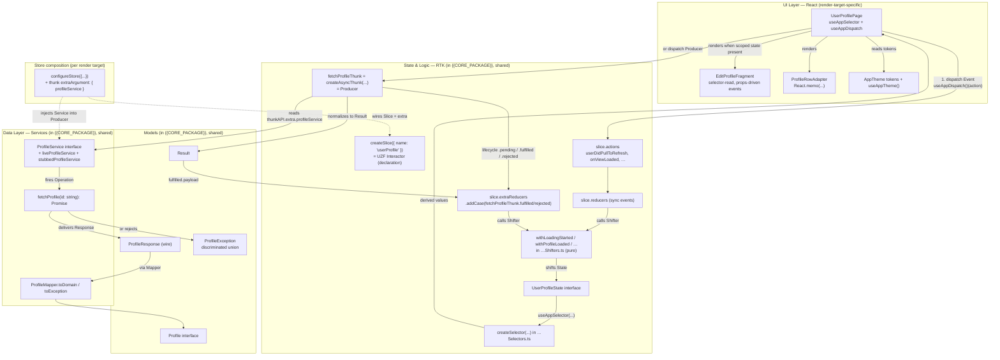

# Stack: `react-uzf-v1` — React + Redux Toolkit UZF Architecture Handbook

Concrete UZF bindings for **React 19, Redux Toolkit 2.x, TypeScript 5.5+**, spanning
**two render targets that share one state-logic tier**: **Next.js 15 (App Router)**
for web and **Expo SDK 55 (RN 0.84, New Architecture + Hermes) with Expo Router**
for mobile. Sasuke cites these as `RC-{n}`. They **implement** the cross-platform
rules in [`../../uzf-core.md`](../../uzf-core.md) (`UZF-{n}`) with React/RTK
specifics — an `RC-{n}` rule may tighten but never contradict its `UZF-{n}` parent.

Reference implementation: none yet — `react-uzf-v1` has no live reference product.
Examples below are illustrative (a placeholder product `{{PROJECT_NAME}}`);
genuinely repo-specific values are `{{TOKEN}}` placeholders. Rule numbers are
append-only.

> **`RC-{n}` numbering.** This stack's canonical `RC-{n}` registry is anchored on
> [`rules/00-architecture-overview.md`](rules/00-architecture-overview.md) — `RC-1`
> through `RC-20` there are authoritative and never renumbered. Every other rule
> file in `rules/`, and this condensed file, cite that same registry; the full
> `RC-1…RC-63` table (with each rule's source file and any folded-in duplicates)
> lives in [`rules/README.md`](rules/README.md). This file is a condensed,
> cross-cutting **overview** of the registry — it does not mint its own numbers.

---

## A. The Interactor (slice) & event loop (implements UZF-1, UZF-2, UZF-3, UZF-12)

**RC-1 — One slice per feature.** `createSlice({ name: "userProfile", ... })` is
exactly one per feature, filename `…Feature.ts`, co-located with its selectors,
shifters, and producer in one feature folder (UZF-6). Slices never import each
other directly — cross-slice communication happens only through root-level
selectors composed at the store, never a sibling slice's internals (this
cross-slice-import ban is `RC-20`; see `rules/00-architecture-overview.md`).

**Events name intent or signal, never mechanism; one completion event per
action** (`RC-2`, UZF-2/UZF-3 — full naming taxonomy in
`rules/10-naming-and-layout.md`). Reducer keys and thunk type strings are
`userDidPullToRefresh`, `onViewLoaded`, `userDidTapEdit`, `childXDelegatedY` —
never named after the mechanism (`fetchProfile`, `loadData`).
`createAsyncThunk` type strings are `feature/onSomethingCompleted`; RTK's
auto-appended `.pending`/`.fulfilled`/`.rejected` are the only lifecycle split
(the mechanics of that split are `RC-26`). A hand-written `onSomethingFailed`
sibling event is forbidden — success and failure unify in the one
`.fulfilled`/`.rejected` pair per UZF-3.

**Exhaustiveness check** (`RC-9`; canonical `assertNever` implementation and
full scope note in `rules/02-store-setup.md`). Every hand-written
`switch`/discriminated dispatch over an Event or Exception kind ends with
`assertNever(value)` from `library/assertNever.ts`. A new case that is not
handled everywhere is a compile error, not a runtime surprise. (Inside
`createSlice`'s own `reducers`/`extraReducers` map, TypeScript's case-key
exhaustiveness on the action map is already the equivalent guarantee —
`assertNever` is for hand-written `switch` statements elsewhere, e.g. a
Mapper's `toException` or an `…Exception["kind"]` check outside the slice.)

## B. State, Shifters, Selectors (implements UZF-8, UZF-9, UZF-10, UZF-11)

**Shifters are the only mutation path** (`RC-4`, UZF-10; naming detailed in
`rules/10-naming-and-layout.md`). Inside a reducer arm, the only mutation is
`Object.assign(state, withFoo(state, args))` — a pure shifter call (Form B) —
unless the change is a single primitive assignment. Shifters live in
`…Shifters.ts` (`with…` naming), read no clock/random/env/service, and are
unit-tested independently of the slice.

**Selectors live in `…Selectors.ts`** (`RC-5`, UZF-11; naming detailed in
`rules/10-naming-and-layout.md`). All derived reads are built with RTK's
`createSelector` and named `…Selector`. Selector logic written inline inside a
`useAppSelector(state => ...)` arrow function is a review-reject, even for a
single-field read — extract it to a named selector.

**Typed hooks only** (`RC-10`; full contract in `rules/02-store-setup.md`).
Components use the typed `useAppSelector` / `useAppDispatch` from
`library/hooks.ts` exclusively. Raw `react-redux` `useSelector`/`useDispatch`
— and the legacy `connect()` HOC — are forbidden; they bypass the
`RootState`/`AppDispatch` typing the rest of this handbook assumes.

## C. Effects & Producers (implements UZF-3, UZF-12, UZF-13, UZF-14, UZF-15)

**RC-3 — Effects are built by Producers; Producers are state-free factories.**
Components never call `fetch`/`axios` directly and never wrap one in
`useEffect(() => { ... }, [])`. Every effect is a `createAsyncThunk` factory in
`…Producer.ts`; a Page dispatches it (`dispatch(fetchProfileThunk(...))`) — it
never performs the I/O itself (UZF-13). A Producer takes the specific inputs its
effect needs (ids, params) — never the whole `State` — via `createAsyncThunk`'s
payload argument, and reads its Service only through `thunkAPI.extra` (`RC-6`). It
performs no I/O at module load and is unit-testable by invoking the thunk in
isolation (UZF-15).

**Thunks return `Result<T, E>`; they never throw** (`RC-7`; canonical
`Result` contract in `rules/02-store-setup.md`). A payload creator normalizes
every outcome into `Result<T, …Exception>` (UZF-14) instead of throwing.
`.rejected` arms exist only as a defensive fallback for genuinely unexpected
engine failures, never as the primary error path (the full
`.pending`/`.fulfilled`/`.rejected` handling contract is `RC-26`). State — and
the `Result`'s error channel — never carries a raw `string` or `Error`: every
domain failure is a discriminated union (`ProfileException`), produced by a
Mapper's `toException` inside the Producer (UZF-17).

**RC-16 — RTK Query is Service-tier, not Page-tier.** RTK Query is permitted for
purely network-cache-driven slices, but its endpoints — and their
auto-generated `use…Query`/`use…Mutation` hooks — are **forbidden inside Pages and
Fragments**. A Page dispatches a Producer thunk; that thunk may delegate to an
RTK Query endpoint under the hood. This keeps a Page's only I/O surface at
`dispatch`, per `RC-3`.

## D. Page / Fragment / Component split (implements UZF-4, UZF-5, UZF-6, UZF-7)

**RC-61 — Three-tier render split.** React realizes the UZF wrapper/renderer
split (UZF-4) as three tiers, not two:

- **Page** (`function …Page()`) — the stateful wrapper. It alone calls
  `useAppSelector`/`useAppDispatch` and dispatches Producer thunks (an *active*
  artifact per UZF-7; the Page's own shape is `RC-37`).
- **Fragment** (`function …Fragment()`) — the UZF-5 domain-bound reusable unit.
  It MAY call `useAppSelector` for its own derived reads, but MUST NOT dispatch an
  async thunk; it receives its event callbacks as props from the Page (*passive*
  — it reacts, the Page decides) — this Fragment contract is `RC-15`.
- **Component** (under `design/`) — the UZF-4 pure renderer. Plain React, no RTK
  hooks, no domain types, previewable from mock props alone — this Component
  contract is `RC-14`.

A Page assembles Fragments and Components; a Fragment assembles Components; only
a Page owns effects. `React.memo` + stable keys on list Adapters (`RC-18`) is
expected but does not change this tier assignment.

**RC-11 — Stories and mock volume (implements UZF-18, UZF-26).** Every Page and
Fragment ships ≥3 Storybook stories mirroring its snapshot tests 1:1. Every
domain model backing them declares ≥7 mock variations in a build-excluded
`__mocks__/*.mocks.ts` file (`RC-13`; UZF-18's 3-convenient/1-neutral/3-inconvenient
floor).

## E. Services, data & DI (implements UZF-16, UZF-17)

**Services are injected via the thunk `extra` argument** (`RC-6`; full
`ThunkExtra` contract in `rules/02-store-setup.md`). Define a Service
interface; wire it through
`configureStore({ middleware: (gd) => gd({ thunk: { extraArgument } }) })`.
Reducers never import a Service directly (UZF-13) — only Producers read it, via
`thunkAPI.extra.profileService`.

**RC-33 — Every Service ships live + stubbed.** A new Service operation is added
to the interface once, then implemented twice: `live…Service` (real I/O) and
`stubbed…Service` (deterministic, backed by a fixture JSON file) — never one
without the other. The operation returns a wire `…Response`; a co-located
`…Mapper` (`toDomain`/`fromDomain`/`toException`) converts it to a domain type
before the Producer ever touches state (UZF-17). Domain types are never
serialization-annotated; `…Response` types never gain UI-facing identity/behavior.

## F. Testing (implements UZF-18, UZF-19, UZF-20)

**RC-12 — Per-artifact test minimums.** Every reducer arm carries ≥3 unit tests,
each named for a real-world scenario (`test_<event>_<condition>_<expectation>`,
UZF-20) — never `test_state`/`test_works`. Every Shifter, Selector, and Producer
method independently carries ≥3 tests of its own (UZF-18; the per-artifact test
patterns are `RC-54`–`RC-56`). CI enforces the touched-file coverage floor
(UZF-19) via `{{CI_TEST_WORKFLOW}}`; Vitest/Jest + React Testing Library run the
unit/reducer suite (toolbox: `RC-53`), Storybook backs the snapshot set
referenced by `RC-11`.

## G. Anti-patterns (auto-reject)

`useState` for anything that is feature state (`RC-4`, `RC-61`) · direct `fetch`/
`axios` from a component or Page (`RC-3`) · `useEffect(() => { fetch(...) }, [])`
inside a Page (`RC-3`) · throwing out of a `createAsyncThunk` payload creator
(`RC-7`) · a Producer/thunk returning anything other than a `Result` (`RC-7`) · the
`connect()` HOC (`RC-10`) · cross-slice state imports (`RC-20`) · a selector defined
inline inside a component instead of `…Selectors.ts` (`RC-5`) · a new `…Service`
without a `stubbed…Service` companion and fixture JSON (`RC-33`) · a reducer arm
added without a matching test in the same PR (`RC-12`) · an action name missing the
`userDid…`/`on…`/`childXDelegated…` prefix (`RC-2`) · a Fragment dispatching an
async thunk (`RC-15`) · an RTK Query hook called from a Page or Fragment (`RC-16`).

## H. The family model: shared core, two render targets (implements UZF-6, UZF-4, UZF-16)

`react-uzf-v1` is **one architecture family realized on two render targets that
share a single state-logic tier**. A feature's slice, selectors, shifters,
Producer, services, and mappers are authored **once**, in `{{CORE_PACKAGE}}`
(e.g. `packages/core`, published as `@{{PROJECT_NAME}}/core` and consumed as a
workspace dependency), and imported unmodified by both:

- **`{{WEB_APP}}`** — a Next.js 15 App Router web app (its own render-target
  rules cover the Server/Client Component split, `NavigationService` over
  `next/navigation`, and `NEXT_PUBLIC_*` environment scoping).
- **`{{MOBILE_APP}}`** — an Expo SDK 55 (RN 0.84, New Architecture + Hermes) app
  on Expo Router (its own render-target rules cover the route-file boundary,
  `NavigationService` over Expo Router's imperative `router`, and
  `EXPO_PUBLIC_*` environment scoping).

Only the **render layer** differs. `RC-61`'s Page/Fragment/Component tier is
written once per target — JSX host primitives, navigation, and platform theming
differ — but it dispatches the exact same actions, reads the exact same
selectors, and triggers the exact same Producer thunks as its sibling on the
other target. Cross-navigation (Solito v5) and cross-UI primitives (Tamagui)
exist to shrink how much of even that render layer must be duplicated, but they
are UI-tier tools: they never reach into `{{CORE_PACKAGE}}` (`RC-51`).

**RC-50 — `{{CORE_PACKAGE}}` is framework-blind.** `{{CORE_PACKAGE}}` never
imports a render-target framework module — no `next/*`, no `expo-router`, no
React Native host primitive (`Platform`, `NativeModules`) — and no
target-specific navigation/storage/system API. Everything a slice or Producer
needs from the platform (navigation, environment, secure storage, system APIs) is
a Service/Provider interface declared in `{{CORE_PACKAGE}}`; each render target
supplies its own `live…Service` binding, registered into `configureStore`'s
`extraArgument` at that target's composition root (`app/providers.tsx` on
Next.js, `app/_layout.tsx` on Expo). This is the same rule
`08-monorepo-and-sharing.md` states as its package-ownership contract.

**RC-62 — Render-target entry files are thin shells.** Both render targets front
the shared UZF Page with a framework-native entry file that does **only**
param/prop resolution and rendering — never slice logic, never a direct Service
call. On Next.js this is the passive Server `page.tsx` plus its
`…PageClient.tsx` wrapper (`RC-38`, `RC-39`); on Expo this is the `app/**/*.tsx`
route file (`RC-44`). Each render target's own rules fix that file's line
ceiling and forbidden imports; this rule only fixes the shape — entry file →
shared UZF Page, one direction, no logic in between.

**RC-63 — Platform singletons are the sole import boundary.**
`NavigationService`, the public-surface half of `EnvironmentProvider`, and
`useAppTheme()` are the **only** files in a render target permitted to import
that target's native module (`next/navigation`, Expo Router's imperative
`router`, `next-themes`/the native theme substrate). A Producer or Reducer that
needs navigation calls `navigationService.push(...)` — it never imports the
target's router directly, on either target (`RC-17` is the narrower "router is a
Service" statement of this same boundary).

A new screen still owes a `{{DOCS_ROOT}}/<Name>.md` feature spec (UZF-21) and, if
user-visible, an entry in `{{FLAG_ENUM}}` (UZF-22) — written once, since the spec
is framework-agnostic and the flag registry lives in `{{CORE_PACKAGE}}`, where
both render targets read it identically.

## I. The UZF loop, realized (React + Redux Toolkit)

Everything inside `Logic`, `Data`, and `Models` lives in `{{CORE_PACKAGE}}` and is
identical whether the `UI` subgraph is rendered by `{{WEB_APP}}` or
`{{MOBILE_APP}}` — only `Store` composition (which `live…Service` gets injected,
which `NavigationService`/theme substrate backs `Theme`) is render-target-bound.

## Glossary (UZF → React/RTK)

| UZF | React + RTK |
| --- | --- |
| Page (stateful wrapper) | `function …Page()` — `useAppSelector` / `useAppDispatch` |
| Fragment (domain-bound, passive) | `function …Fragment()` — selector reads OK, dispatch only via callback props |
| Component (pure renderer) | Plain `function …()` under `design/`, no Redux |
| Adapter | `React.memo`-wrapped `function …Adapter({ item, onTap })` |
| Theme | `theme.ts` exporting tokens + `useAppTheme()` |
| Interactor | `createSlice({ name: '…' })` exported as `…Slice` |
| State | `interface …State` co-located with the slice |
| Event | An auto-generated `slice.actions` case, or a dispatched thunk action |
| Reducer | `reducers` + `extraReducers` blocks of `createSlice` |
| Shifter | Pure `with…(state, args)` function in `…Shifters.ts` |
| Selector | `createSelector(...)` in `…Selectors.ts`, consumed via `useAppSelector` |
| Producer | Module exporting `createAsyncThunk(...)` factories |
| Effect | The promise returned by an async thunk |
| Service | TS interface + `live…Service` + `stubbed…Service` |
| Operation | A method on a Service interface |
| Mapper | `…Mapper` module exporting `toDomain` / `fromDomain` / `toException` |
| Result / Exception | `Result<T, E>` from `library/result.ts` / discriminated union (`…Exception`) |
| Repository | Plain TS class coordinating multiple Services (only if state/caching is genuinely needed) |
| Provider | Module exporting synchronous helpers (`EnvironmentProvider.current()`) |

Render-target-specific glossary entries (Next.js's Server Page / Client Page
Wrapper / Route handler; Expo's route file / `_layout.tsx`) belong to this
stack's Next.js and Expo render-target rules, not to this family-level file —
this file fixes only the shared-core vocabulary above, per §H.
